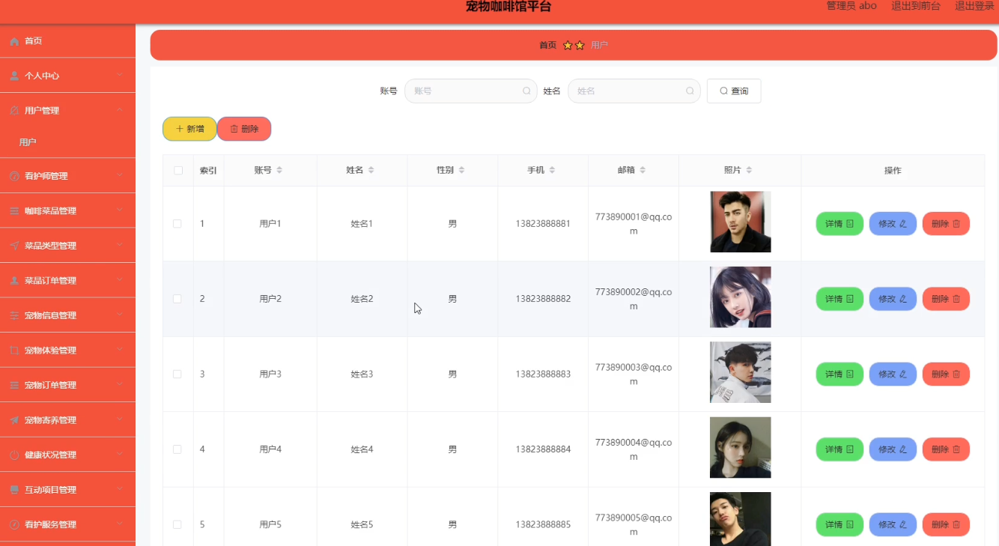
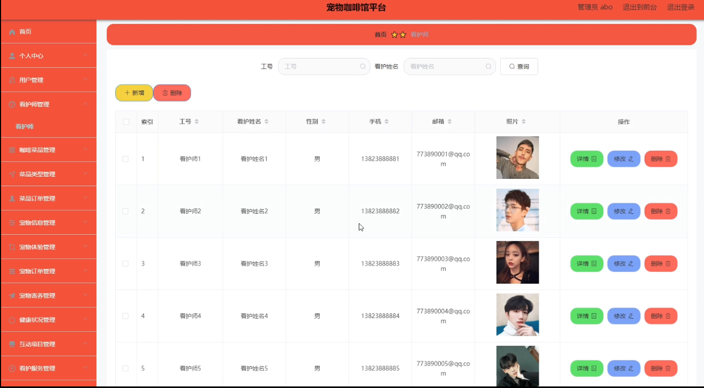
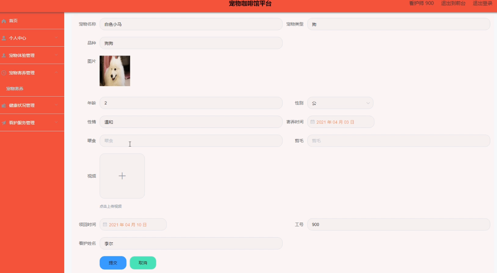
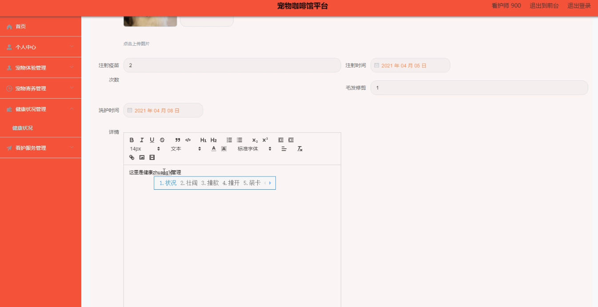
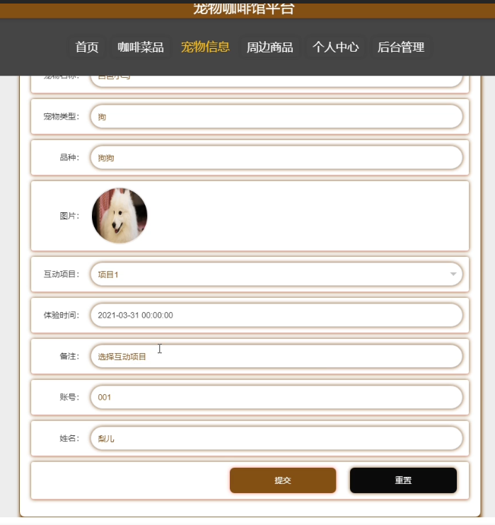

基于SpringBoot的宠物咖啡馆平台
=
- 完整代码获取地址：从戎源码网 ([https://armycodes.com/](https://armycodes.com/))
- 作者微信：19941326836  QQ：952045282 
- 承接计算机毕业设计、Java毕业设计、Python毕业设计、深度学习、机器学习
- 选题+开题报告+任务书+程序定制+安装调试+论文+答辩ppt 一条龙服务
- 所有选题地址https://github.com/nature924/allProject

一、项目介绍
---
系统包含两种角色：用户、管理员，系统分为前台和后台两大模块，主要功能如下：

### 1 管理员模块的实现

用户信息管理
系统管理员可以管理用户，对用户信息进行添加、修改、删除和查询操作。

看护师信息管理
系统管理员可以对看护师信息进行添加、修改、删除和查询操作。

### 2看护师模块的实现

宠物寄养管理
看护师可以对宠物寄养信息进行添加、修改、删除和查询操作。

健康状况管理
看护师可以对健康状况信息进行添加、修改和删除操作。

### 3 用户模块的实现

点单
用户登录之后，可以在咖啡菜品信息界面进行点单操作。

宠物体验
用户登录后可以在首页点击宠物体验，并提交相关信息。

二、项目技术
---
- 编程语言：Java
- 数据库：MySQL
- 项目管理工具：Maven
- 前端技术：VUE、HTML、Jquery、Bootstrap
- 后端技术：Spring、SpringMVC、MyBatis

三、运行环境
---
- 操作系统：Windows、macOS都可以
- JDK版本：JDK1.8以上都可以
- 开发工具：IDEA、Ecplise、Myecplise都可以
- 数据库: MySQL5.7以上都可以
- Tomcat：任意版本都可以
- Maven：任意版本都可以

四、运行截图
---

### 程序截图：

